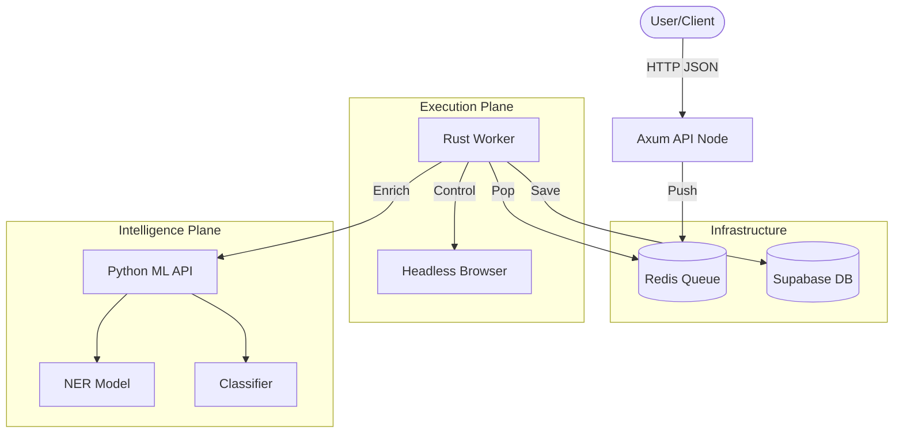

# System Architecture: The "Hybrid Intelligence" Crawler

## 1. What is this system? (Beginner Overview)
Imagine you have a **Super-Assistant** who can:
1.  **Browse the Web** like a human (scrolling, reading, waiting).
2.  **Read and Understand** content (finding headlines, "selling points").
3.  **Think** (deciding if text is "Positive" or "Negative", or if it's about "Space" or "Business").

This repository builds that assistant. It is "Hybrid" because it uses **Rust** for speed and muscle (browsing), and **Python** for brainpower (AI/ML).

---

## 2. The "Org Chart" (Who does what?)

| Component | Analogy | Technical Role |
| :--- | :--- | :--- |
| **User (You)** | The Boss | Sends commands via `POST /crawl`. |
| **API Server** | The Receptionist | Takes your order, gives you a ticket ID, and puts the job in the queue. |
| **Redis** | The Inbox | A waiting list. Holds jobs until a worker is free. |
| **Worker** | The Employee | The hard worker. Pick up a job, opens the browser, does the browsing. |
| **Chrome** | The Eyes & Hands | The actual browser window (invisible/headless) that visits websites. |
| **Python Sidecar** | The Consultant | Smart but slow. The Worker asks it: "Is this text about Tech?" |
| **Supabase DB** | The Filing Cabinet | Where all finished reports and data are stored forever. |

---

## 3. The Workflow: A Day in the Life of a Request

### Step 1: The Request 📨
You send a message: *"Go scan this Facebook Group."*
*   **Action**: `POST /crawl`
*   **Result**: You get a Tracking ID (`task_id`). The system says "On it!"

### Step 2: The Setup 🕵️
The **Worker** picks up the tracking ID.
*   **Identity Check**: It looks in its wallet (`cookies.json`) for your Facebook ID card.
*   **Disguise**: It puts on a disguise (Stealth Mode) so Facebook thinks it's a real person on a laptop.

### Step 3: The Mission 🧗
The **Worker** opens **Chrome** and goes to the URL.
*   **Safety First**: It pauses randomly (5-12 seconds). It scrolls down slowly to let posts load.
*   **Extraction**: It reads the page. It grabs "Headlines", "Benefits", and "Posts".

### Step 4: The Brain Work (AI Integration) 🧠
The Worker has the text, but needs to understand it.
1.  **Sentiment**: Rust quickly checks: "Are these words happy or sad?" -> *"Neutral"*
2.  **NER (Who/What/Where)**: Rust asks Python: "Who is mentioned here?" -> *"Elon Musk (Person), SpaceX (Org)"*
3.  **Classification**: Rust asks Python: "What topic is this?" -> *"Technology"*

### Step 5: Filing the Report 📂
The Worker compiles everything into a final report and saves it to **Supabase**.

---

## 4. Where is my Data? (Database Guide)

All your results are stored in the `tasks` table. Here is where to look for the AI results:

| If you want... | Look in Column... | What it looks like (Example) |
| :--- | :--- | :--- |
| **Headlines / Benefits** | `marketing_data` | `{"headlines": ["Boost ROI"], "benefits": ["Fast", "Secure"]}` |
| **Is it Positive?** | `sentiment` | `"Positive (0.92)"` or `"Negative (0.12)"` |
| **What topic is it?** | `category` | `"Business"`, `"Health"`, `"Technology"` |
| **Who is mentioned?** | `entities` | `[{"text": "Apple", "label": "ORG"}]` |
| **Raw Page Text** | `extracted_text` | `"Welcome to our website..."` |

**SQL Query Example:**
```sql
-- "Show me all Logic Tech articles that mention OpenAI"
SELECT * FROM tasks 
WHERE category = 'Technology' 
AND entities::text LIKE '%OpenAI%';
```

---

## 5. Technical Architecture (For Engineers)

### Service Interaction Map


### Protocols
*   **Rust <-> Redis**: TCP (RESP Protocol)
*   **Rust <-> Chrome**: WebSocket (Chrome DevTools Protocol)
*   **Rust <-> Python**: HTTP (REST API)
*   **Rust <-> Database**: TCP (PostgreSQL Wire Protocol)
